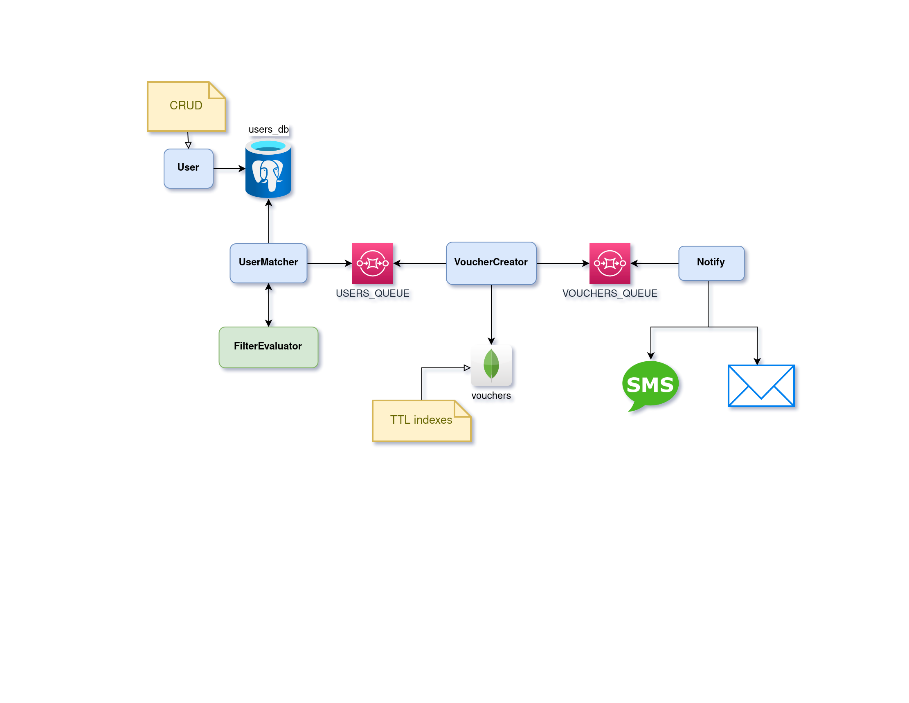

## Overview

VSG, Voucher Generation System, is a set of microservices-like components to generate vouchers for users that match given filters. Microservices-like because even though all components run in a single binary, they can be deployed separately with minimal effort.

Currently just two filters are available, byCity and byLastLogin. User notification is via email. Communication is done via SQS. Vouchers expire after a fixed amount of time (may last a little longer due to the fact that MongoDB may take a while to delete records). More info:
- HTTP server runs on [localhost:8080](localhost:8080)
- MongoDB UI is accessible on [localhost:8081](localhost:8081)
- Prometheus metrics are exposed on [localhost:8091/metrics](localhost:8091/metrics)
- SMTP server listens on [localhost:1025](localhost:1025)

## Main Dependencies

Docker, docker-compose, and optionally golang.

## Setup

Build Docker image with `make image`; a local binary can be generated with `make build`. To run the app, first boot up the dependencies by running `docker-compose -f docker-compose.yml up --remove-orphans` on a separate terminal. Finally, execute `make run`. Run `make gorun` to execute locally instead.

## Test

Execute unit and integration tests with `make test`. Make sure to start the dependencies first.

## API

A Postman collection is available on file `vsg.postman_collection.json`. `date` field in payloads is unix timestamp in seconds.

## Architecture

## TODO

- business metrics
- evaluation of multiple filters sequentially
- prevent voucher usage if it has been expired but not deleted yet
- notify user according to their preferences
- DLQ
- split components into microservices
- run on k8s
- customizable vouchers
